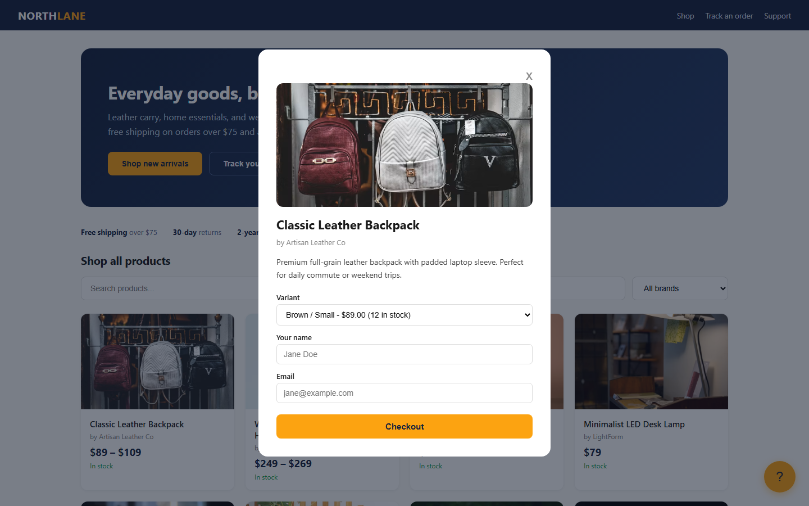
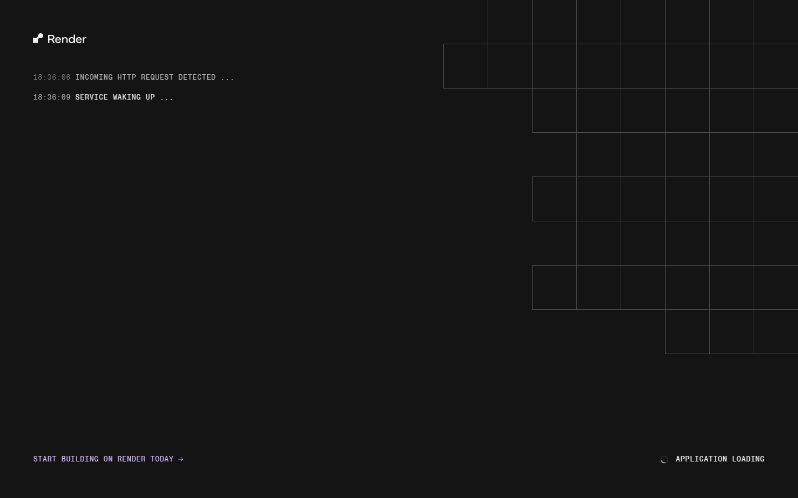
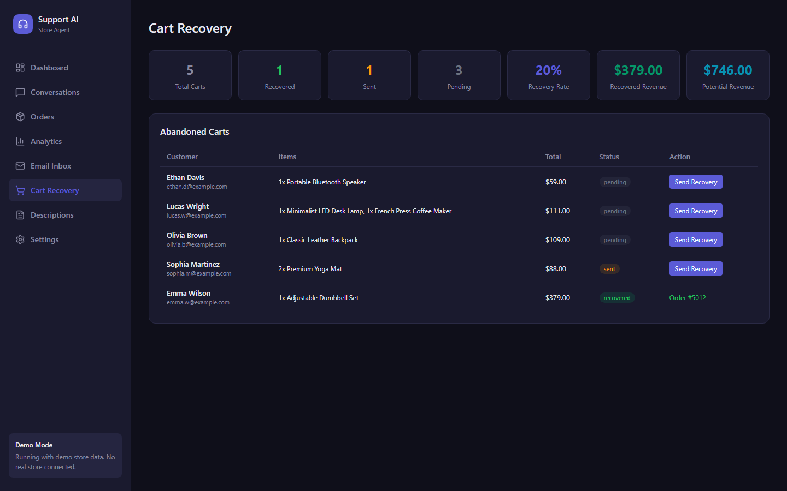
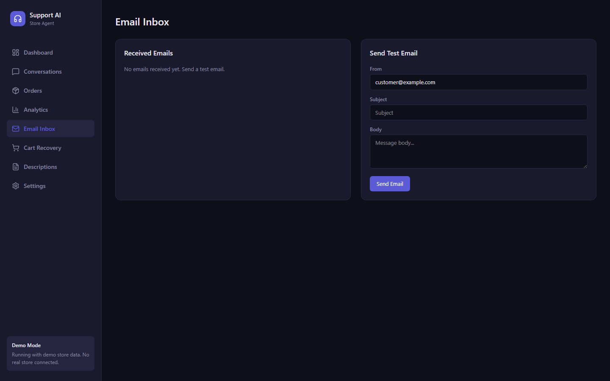
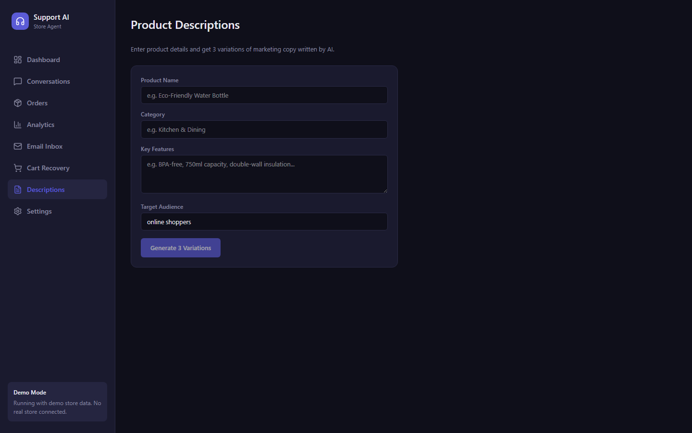
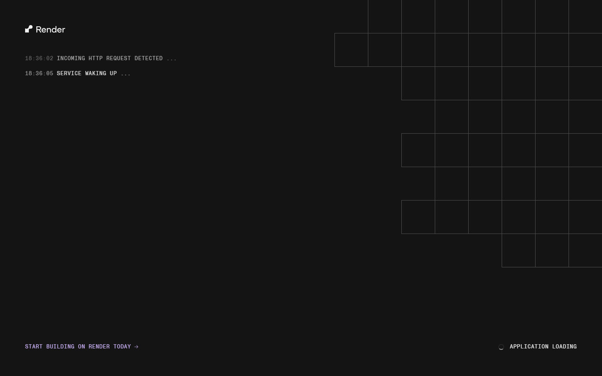
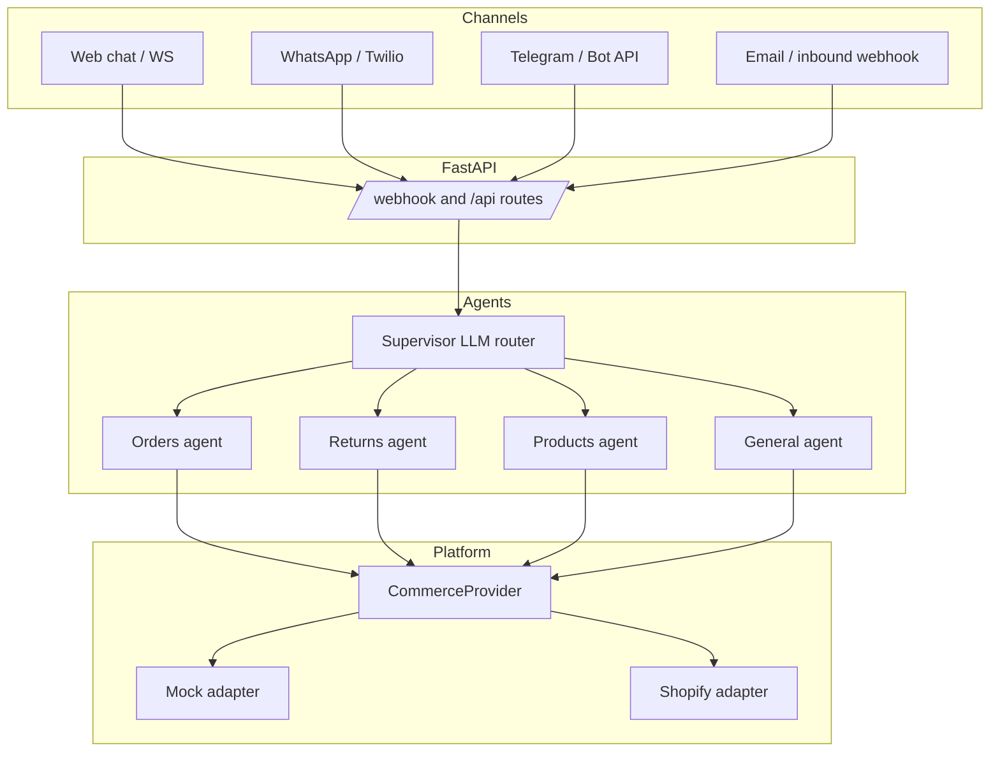

<a id="readme-top"></a>

<div align="center">

  

  <h1>Store Agent</h1>

  <p>
    AI customer support for online stores that do not have a support team.<br>
    It answers order, return, product and policy questions from live store data.<br>
    One agent that works across web chat, WhatsApp, Telegram and email.
  </p>

  <p>
    <a href="https://store-agent-app.onrender.com/store.html">View the live demo</a>
    &middot;
    <a href="https://github.com/coder-red/store-agent/issues/new?labels=bug&template=bug-report---.md">Report a bug</a>
    &middot;
    <a href="https://github.com/coder-red/store-agent/issues/new?labels=enhancement&template=feature-request---.md">Request a feature</a>
  </p>

  
  
  
  
  
  

</div>

---

<details>
  <summary>Table of Contents</summary>
  <ol>
    <li><a href="#about-the-project">About the Project</a></li>
    <li><a href="#screenshots">Screenshots</a></li>
    <li><a href="#key-features">Key Features</a></li>
    <li>
      <a href="#getting-started">Getting Started</a>
      <ul>
        <li><a href="#prerequisites">Prerequisites</a></li>
        <li><a href="#installation">Installation</a></li>
      </ul>
    </li>
    <li><a href="#usage">Usage</a></li>
    <li><a href="#architecture">Architecture</a></li>
    <li><a href="#adding-a-storefront-platform">Adding a Storefront Platform</a></li>
    <li><a href="#api">API</a></li>
    <li><a href="#deployment">Deployment</a></li>
    <li><a href="#roadmap">Roadmap</a></li>
    <li><a href="#contributing">Contributing</a></li>
    <li><a href="#license">License</a></li>
    <li><a href="#contact">Contact</a></li>
  </ol>
</details>

---

## About the Project

Store Agent answers the questions that make up most of a store's day to day support: where is my order, can I return this, do you stock it in blue, what is your policy, and I need a human. It reads from the store's real data instead of guessing, and it hands anything uncertain to the store owner with the full conversation attached.

The storefront is a plugin. `CommerceProvider` defines the interface, and Shopify ships as the reference adapter. Any other platform, such as WooCommerce, Medusa or a custom backend, connects by implementing that one interface.

It runs on four channels at once: web chat, WhatsApp, Telegram and email. The owner dashboard shows the conversations, order data, analytics, abandoned carts and incoming email in one place.

### Design decisions

| Decision | Why |
|---|---|
| The model only answers from tools | Every order or product answer is a tool result, never a guess from memory. |
| Escalation is a tool, not a bug path | The agent decides to escalate like any other action, so it can include a reason and a summary. |
| The storefront is a plugin | The core calls a seven method contract and never knows which platform it runs on. |
| Every channel shares one base adapter | Adding a new channel is one file that implements two methods. |
| SQLite by default, no setup | Conversations and escalations persist to a local file with zero configuration. |

<p align="right">(<a href="#readme-top">back to top</a>)</p>

## Screenshots

The customer storefront, running against the live demo:

<div align="center">
  
</div>

The product page with the chat widget:

<div align="center">
  
</div>

The owner dashboard views:

<div align="center">
  
  
  
</div>

<div align="center">
  
  
  
</div>

<div align="center">
  
</div>

<p align="right">(<a href="#readme-top">back to top</a>)</p>

## Key Features

- Answers from real store data with six tools: orders, returns, products, fulfillment, policies and escalation
- Escalates instead of guessing: uncertain questions go to the owner with the full context
- Multi channel: web chat, WhatsApp, Telegram and email from one agent and the same tools
- Pluggable storefronts: a `CommerceProvider` interface that swaps Shopify for any platform
- Owner dashboard: conversations, analytics, orders, email inbox, cart recovery and product descriptions
- Sentiment tagging: every message is tagged positive, neutral or negative
- Cart recovery: drafts a personalised win back message for each abandoned cart
- Demo mode: `PLATFORM=mock` runs with sample data, no store connected

<p align="right">(<a href="#readme-top">back to top</a>)</p>

## Getting Started

### Prerequisites

* Python 3.10+
* Node.js 18+
* A [Groq](https://groq.com) API key. The free tier works and the demo deploy uses it.

### Installation

1. Clone the repository
   ```sh
   git clone https://github.com/coder-red/store-agent.git
   ```
2. Install the backend dependencies
   ```sh
   pip install -r requirements.txt
   ```
3. Copy the example environment file
   ```sh
   cp .env.example .env
   ```
4. Start the backend
   ```sh
   uvicorn app.main:app --reload --port 8000
   ```
5. Start the dashboard
   ```sh
   cd frontend && npm install && npm run dev
   ```
6. Open the dashboard in your browser

The environment file `.env.example` lists every variable and what it does. The demo runs out of the box with `PLATFORM=mock`, no store credentials needed.

<p align="right">(<a href="#readme-top">back to top</a>)</p>

## Usage

Send a test message to the local backend:

```sh
curl -X POST localhost:8000/webhook/test \
  -H 'content-type: application/json' \
  -d '{"customer_identifier":"demo","message":"Where is my order #1006?"}'
```

Connect a real store in one of two ways:

- Run with `PLATFORM=shopify` and set the `SHOPIFY_*` variables in `.env`.
- Or enter the credentials in the dashboard Settings screen and select the channel there. This is the option that works for a deployed app, because the channels are stored in the database.

You can use a custom adapter by pointing `PLATFORM` at it, for example `PLATFORM=my_pkg.adapters:WooAdapter`. See [Adding a Storefront Platform](#adding-a-storefront-platform).

Switch the channel with `CHANNEL` set to `webchat`, `whatsapp`, `telegram` or `email`. WhatsApp uses Twilio, Telegram uses the Bot API, and email uses Resend.

<p align="right">(<a href="#readme-top">back to top</a>)</p>

## Architecture



A message enters through a channel, hits the FastAPI route, and the supervisor routes it to one of four specialist agents. Each specialist is a LangGraph ReAct agent that only has the tools it needs, and every tool call goes through `CommerceProvider`. Escalated conversations, conversation history and analytics persist to SQLite by default.

### Design details

- **Six tools, one source of truth**: `get_order_status`, `check_return_eligibility`, `get_product_info`, `check_fulfillment_status`, `query_store_policies`, `escalate_to_human`. Each returns from the store, never from memory.
- **Four specialists plus a router**: orders, returns, products and general. Each agent is a React agent with a focused prompt and only the tools for its job.
- **Supervisor picks the specialist**: a single LLM call classifies the message and the UI shows which specialist answered.
- **Streaming end to end**: web chat gets tokens over WebSocket and the dashboard subscribes to the same stream.

<p align="right">(<a href="#readme-top">back to top</a>)</p>

## Adding a Storefront Platform

Subclass `CommerceProvider` and implement the seven required async methods:

```python
from app.commerce.base import CommerceProvider

class MyPlatformAdapter(CommerceProvider):
    platform_name = "myplatform"
    # get_order_by_number, get_order_by_email, search_products,
    # get_fulfillments, get_all_products, get_all_orders, check_inventory
```

Three optional methods default to a safe no-op so every store works out of the box: `get_order` looks up a single order, and the cart recovery trio (`get_abandoned_carts`, `attempt_cart_recovery`, `mark_cart_recovered`) reads and updates abandoned carts. Override them when your platform supports cart recovery.

Then set:

```sh
PLATFORM=my_store.adapter:MyPlatformAdapter
```

Built in options: `PLATFORM=mock` for the demo store and `PLATFORM=shopify` for the reference adapter, which uses the `SHOPIFY_*` credentials.

<p align="right">(<a href="#readme-top">back to top</a>)</p>

## API

| Route | Purpose |
|---|---|
| `POST /webhook/test` | Send a message as a customer, get the agent's reply |
| `POST /webhook/whatsapp` | Inbound WhatsApp webhook |
| `POST /webhook/telegram` | Inbound Telegram update |
| `POST /webhook/email` | Inbound email webhook |
| `WS /ws/chat` | Streaming web chat and dashboard live events |
| `GET /api/conversations`, `GET /api/conversations/{id}` | Transcripts |
| `GET /api/orders`, `GET /api/orders/{id}` | Owner order ledger and per order detail with line items |
| `GET /api/escalations`, `GET /api/analytics` | Owner views |
| `GET /api/emails` | Email inbox |
| `GET /api/products` | Product catalogue with images |
| `POST /api/generate-descriptions` | Product description generator |
| `GET /api/settings`, `PUT /api/settings` | Read and update store settings |
| `GET /api/channels`, `PUT /api/channels` | Read and update channel credentials |
| `GET /store/carts/abandoned` | Abandoned carts |
| `POST /store/carts/{id}/recover` | Draft a recovery message for one cart |
| `POST /store/carts/auto-recover` | Draft recovery messages for all carts |
| `GET /store/carts/recovery-stats` | Cart recovery summary |
| `GET /store/products` | Customer facing product list |
| `POST /store/orders` | Place an order against the demo store |
| `GET /store/track` | Customer order lookup. Requires both the order number and the checkout email |
| `GET /health` | Mode, platform, channel and model |

<p align="right">(<a href="#readme-top">back to top</a>)</p>

## Deployment

`render.yaml` deploys the API. The dashboard builds to static files, and `frontend/vercel.json` rewrites the API, WebSocket and webhook routes to the backend URL.

The repository deploys automatically to Render on every push to `main`.

<p align="right">(<a href="#readme-top">back to top</a>)</p>

## Roadmap

- [x] Plugin architecture for storefront platforms
- [x] Multi channel support (web, WhatsApp, Telegram, email)
- [x] Owner dashboard with analytics
- [x] Cart recovery agent
- [x] Product description generator
- [x] Demo mode with mock data
- [x] Order detail view from the orders ledger
- [x] Cart recovery through `CommerceProvider`
- [ ] Per tenant isolation
- [ ] Platform return rules integration

See the [open issues](https://github.com/coder-red/store-agent/issues) for the full list of proposed features and known issues.

<p align="right">(<a href="#readme-top">back to top</a>)</p>

## Contributing

Contributions are welcome.

1. Fork the repository
2. Create a feature branch (`git checkout -b feature/AmazingFeature`)
3. Commit your changes (`git commit -m 'Add some AmazingFeature'`)
4. Push to the branch (`git push origin feature/AmazingFeature`)
5. Open a pull request

<p align="right">(<a href="#readme-top">back to top</a>)</p>

## License

This project does not currently include a license file. Until one is added, the default copyright applies, so you need permission from the author before copying, modifying or reusing the code. If you plan to reuse it, please reach out first.

<p align="right">(<a href="#readme-top">back to top</a>)</p>

## Contact

**Mohammed Ahmed Babatunde** - AI engineer, Lagos

[github.com/coder-red](https://github.com/coder-red) · [linkedin.com/in/coder-red](https://linkedin.com/in/coder-red) · mohammed.ds.ml01@gmail.com

Project Link: [https://github.com/coder-red/store-agent](https://github.com/coder-red/store-agent)

<p align="right">(<a href="#readme-top">back to top</a>)</p>
