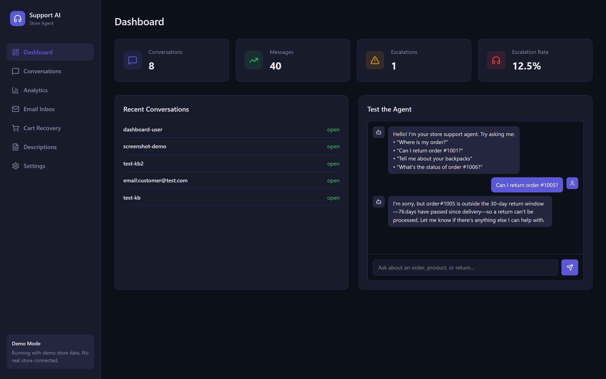

<a id="readme-top"></a>

<div align="center">

  

  <h1>Store Agent</h1>

  <p>
    AI customer support for online stores that don't have a support team.<br>
    Answers order, return, product and policy questions from live store data.<br>
    Plugs into any storefront platform.
  </p>

  <p>
    <a href="https://store-agent-app.onrender.com/store.html">View Demo</a>
    &middot;
    <a href="https://github.com/coder-red/store-agent/issues/new?labels=bug&template=bug-report---.md">Report Bug</a>
    &middot;
    <a href="https://github.com/coder-red/store-agent/issues/new?labels=enhancement&template=feature-request---.md">Request Feature</a>
  </p>

  
  
  
  
  
  
  
  

</div>

---

<details>
  <summary>Table of Contents</summary>
  <ol>
    <li><a href="#about-the-project">About The Project</a></li>
    <li>
      <a href="#getting-started">Getting Started</a>
      <ul>
        <li><a href="#prerequisites">Prerequisites</a></li>
        <li><a href="#installation">Installation</a></li>
      </ul>
    </li>
    <li><a href="#usage">Usage</a></li>
    <li><a href="#features">Features</a></li>
    <li><a href="#architecture">Architecture</a></li>
    <li><a href="#adding-a-storefront-platform">Adding a Storefront Platform</a></li>
    <li><a href="#api">API</a></li>
    <li><a href="#deployment">Deployment</a></li>
    <li><a href="#roadmap">Roadmap</a></li>
    <li><a href="#contributing">Contributing</a></li>
    <li><a href="#license">License</a></li>
    <li><a href="#contact">Contact</a></li>
    <li><a href="#acknowledgments">Acknowledgments</a></li>
  </ol>
</details>

---

## About The Project

[![Dashboard][dashboard-screenshot]](https://store-agent-app.onrender.com)

Solo founders answer the same five questions all day — where is my order, can I return this, do you have it in blue, what is your policy, I need a human — usually across three apps. Hiring support is not an option at that stage; ignoring it costs sales.

Store Agent answers the repetitive 80% from real store data, hands the rest to the owner with context, and shows the founder what customers are actually asking. It runs across web chat, WhatsApp, Telegram and email. One agent, any channel.

The storefront is a plugin. Shopify ships as the reference adapter; WooCommerce, Medusa or your custom backend is one subclass away.

<p align="right">(<a href="#readme-top">back to top</a>)</p>

## Getting Started

### Prerequisites

* Python 3.10+
* Node.js 18+
* A [Groq](https://groq.com) API key (free tier works)

### Installation

1. Clone the repo
   ```sh
   git clone https://github.com/coder-red/store-agent.git
   ```
2. Install backend dependencies
   ```sh
   pip install -r requirements.txt
   ```
3. Set up your environment
   ```sh
   cp .env.example .env
   ```
4. Start the backend
   ```sh
   uvicorn app.main:app --reload --port 8000
   ```
5. Start the dashboard
   ```sh
   cd frontend && npm install && npm run dev
   ```
6. Open the dashboard in your browser

<p align="right">(<a href="#readme-top">back to top</a>)</p>

## Usage

Send a test message:

```sh
curl -X POST localhost:8000/webhook/test \
  -H 'content-type: application/json' \
  -d '{"customer_identifier":"demo","message":"Where is my order #1006?"}'
```

Connect a real Shopify store by setting `PLATFORM=shopify` and adding your store credentials. See [`.env.example`](.env.example) for the full list of environment variables.

Switch channels by setting `CHANNEL` to `webchat`, `whatsapp`, `telegram` or `email`.

<p align="right">(<a href="#readme-top">back to top</a>)</p>

## Features

- Answers from store data — six tools for orders, fulfillment, returns, products, policies and escalation
- Escalates instead of guessing — uncertain questions route to the owner with full context
- Multi-channel — web chat, WhatsApp, Telegram, email, one agent, same tools
- Pluggable storefronts — `CommerceProvider` interface with seven methods, swap Shopify for any platform
- Owner dashboard — conversations, analytics, orders, email inbox, cart recovery, product descriptions, settings
- Sentiment tagging — every message tagged as positive, neutral or negative
- Cart recovery — drafts personalised win-back messages for abandoned carts
- Demo mode — `PLATFORM=mock` runs with sample data, no store connected

<p align="right">(<a href="#readme-top">back to top</a>)</p>

## Architecture

```
  Web chat ──WS──┐
  WhatsApp ──────┤  Twilio webhook          ┌──────────────────────────────┐
  Telegram ──────┤  Bot API        ───────► │ FastAPI                      │
  Email ─────────┘  inbound webhook         │  /webhook/*  /api/*  /ws/chat│
                                           └──────────────┬───────────────┘
                                                          ▼
                                  ┌───────────────────────────────────────┐
                                  │ Supervisor (LLM router)               │
                                  │  orders │ returns │ products │ general│
                                  └───────────────────┬───────────────────┘
                                                      ▼
                                  ┌───────────────────────────────────────┐
                                  │ LangGraph ReAct agent (per category)  │
                                  │ tools → CommerceProvider (the plug)   │
                                  │       → knowledge base               │
                                  │       → escalate_to_human ──► owner   │
                                  └───────────────────┬───────────────────┘
                                                      ▼
                                   ┌────────────────────────────────────┐
                                   │ Platform adapters                  │
                                   │  mock (demo) │ shopify │ yours     │
                                   └────────────────────────────────────┘
                                                      ▼
                                          Supabase (conversations, escalations)
                                          Dashboard (React) ◄── WebSocket events
```

Requests go through a supervisor then specialist layout: a routing call picks orders, returns, products or general, each specialist is a ReAct agent with only the tools it needs, and the dashboard shows which specialist answered. A single-agent variant with the full toolset is kept for comparison.

### Design decisions

| Decision | Why |
|---|---|
| Tools call the store, the model never invents order data | Every order or product answer is a tool result. The system prompt forbids answering from memory. |
| `escalate_to_human` is a tool, not an error path | The model decides to escalate like any other action, so it can include a reason and a summary. |
| The storefront is a plugin, not a feature | `CommerceProvider` is a seven-method contract returning platform-neutral dataclasses. The core does not know Shopify exists. |
| Channel adapters over a shared base | `channels/base.py` defines `send_message` and `send_to_owner`; each channel implements it. Adding a channel is one file. |
| Streaming everywhere | The agent streams events; web chat gets tokens over WebSocket, and the dashboard subscribes to the same stream. |
| Groq for inference | Sub-second first token; the LLM provider and model are env-configurable. |

<p align="right">(<a href="#readme-top">back to top</a>)</p>

## Adding a Storefront Platform

Subclass `CommerceProvider` and implement seven async methods:

```python
from app.commerce.base import CommerceProvider

class MyPlatformAdapter(CommerceProvider):
    platform_name = "myplatform"
    # get_order_by_number, get_order_by_email, search_products,
    # get_fulfillments, get_all_products, get_all_orders, check_inventory
```

Then set:

```sh
PLATFORM=my_store.adapter:MyPlatformAdapter
```

Built-ins: `PLATFORM=mock` (demo store), `PLATFORM=shopify` (uses `SHOPIFY_*` credentials).

<p align="right">(<a href="#readme-top">back to top</a>)</p>

## API

| Route | Purpose |
|---|---|
| `POST /webhook/test` | Send a message as a customer, get the agent's reply |
| `POST /webhook/email` | Inbound email webhook |
| `WS /ws/chat` | Streaming web chat and dashboard live events |
| `GET /api/conversations`, `/api/conversations/{id}` | Transcripts |
| `GET /api/orders` | Owner order ledger |
| `GET /api/escalations`, `/api/analytics` | Owner views |
| `POST /api/generate-descriptions` | Product-description generator |
| `GET /store/carts/abandoned`, `POST /store/carts/{id}/recover` | Cart recovery |
| `GET /store/track` | Customer order lookup |
| `GET /health` | Mode, platform, channel, model |

<p align="right">(<a href="#readme-top">back to top</a>)</p>

## Deployment

`render.yaml` deploys the API. The dashboard builds to static files for Vercel; `frontend/vercel.json` rewrites API, WebSocket and webhook routes to the backend URL.

<p align="right">(<a href="#readme-top">back to top</a>)</p>

## Roadmap

- [x] Plugin architecture for storefront platforms
- [x] Multi-channel support (web, WhatsApp, Telegram, email)
- [x] Owner dashboard with analytics
- [x] Cart recovery agent
- [x] Product description generator
- [x] Demo mode with mock data
- [ ] Per-tenant isolation
- [ ] Platform return rules integration
- [ ] Cart recovery through `CommerceProvider`

See the [open issues](https://github.com/coder-red/store-agent/issues) for a full list of proposed features and known issues.

<p align="right">(<a href="#readme-top">back to top</a>)</p>

## Contributing

Contributions are what make the open source community such an amazing place to learn, inspire, and create. Any contributions you make are **greatly appreciated**.

1. Fork the Project
2. Create your Feature Branch (`git checkout -b feature/AmazingFeature`)
3. Commit your Changes (`git commit -m 'Add some AmazingFeature'`)
4. Push to the Branch (`git push origin feature/AmazingFeature`)
5. Open a Pull Request

<p align="right">(<a href="#readme-top">back to top</a>)</p>

## License

Distributed under the MIT License. See `LICENSE.txt` for more information.

<p align="right">(<a href="#readme-top">back to top</a>)</p>

## Contact

**Mohammed Ahmed Babatunde** — AI engineer, Lagos

[github.com/coder-red](https://github.com/coder-red) · [linkedin.com/in/coder-red](https://linkedin.com/in/coder-red) · mohammed.ds.ml01@gmail.com

Project Link: [https://github.com/coder-red/store-agent](https://github.com/coder-red/store-agent)

<p align="right">(<a href="#readme-top">back to top</a>)</p>

## Acknowledgments

* [LangChain](https://github.com/langchain-ai) — LangGraph agent framework
* [Groq](https://groq.com) — fast inference
* [FastAPI](https://fastapi.tiangolo.com) — backend framework
* [React](https://react.dev) — dashboard UI
* [Supabase](https://supabase.com) — data storage
* [shields.io](https://shields.io) — badges
* [othneildrew/Best-README-Template](https://github.com/othneildrew/Best-README-Template) — README structure

<p align="right">(<a href="#readme-top">back to top</a>)</p>

<!-- MARKDOWN LINKS & IMAGES -->
[dashboard-screenshot]: assets/dashboard.png
