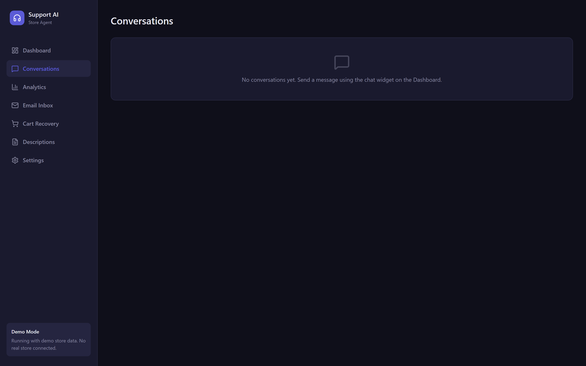

<p align="center">
  
</p>

<h1 align="center">Store Agent</h1>

<p align="center">
  <strong>AI customer support for online stores that don't have a support team.</strong><br>
  A LangGraph agent answers order, return, product and policy questions from live store data across web chat, WhatsApp, Telegram and email — and escalates to the owner when it shouldn't guess. Plugs into any storefront platform.
</p>

<p align="center">
  
  
  
  
  
  
  
  
</p>

---

## The problem

Solo founders answer the same five questions all day — *where's my order, can I return this, do you have it in blue, what's your policy, I need a human* — usually across three apps. Hiring support isn't an option at that stage; ignoring it costs sales. This system answers the repetitive 80% from real store data, hands the rest to the owner with context, and shows the founder what customers are actually asking.

## What it does

- **Answers from store data, not from a prompt.** The agent has six tools: `get_order_status`, `check_fulfillment_status`, `check_return_eligibility` (against the store's return window), `get_product_info`, `query_store_policies` (knowledge base) and `escalate_to_human`.
- **Escalates instead of guessing.** Anything outside those categories, or anything uncertain, is routed to `escalate_to_human`, which pushes the conversation + reason to the owner on their channel (WhatsApp / Telegram / email) and logs it.
- **Multi-channel.** One channel adapter interface, four adapters: web chat (WebSocket), WhatsApp (Twilio), Telegram (Bot API), email (webhook in, Resend out). Set `CHANNEL` and the same agent runs behind any of them.
- **Pluggable storefronts.** The agent core never talks to a platform API directly — it calls a seven-method `CommerceProvider` interface (`app/commerce/base.py`). Shopify ships as the reference adapter; WooCommerce, Medusa or your custom backend is one subclass away. Set `PLATFORM` and go.
- **Owner dashboard.** React + Vite admin: conversations and per-customer transcripts, real-time analytics over WebSocket (volume, escalation rate, sentiment), an email inbox, abandoned-cart recovery, an AI product-description generator, and settings.
- **Beyond support.** Sentiment tagging on every message, low-inventory alerts to the owner, and a cart-recovery agent that drafts personalised win-back messages for abandoned carts.
- **Demo mode.** `PLATFORM=mock` swaps in a demo store (orders #1001–#1015, a product catalogue, policies) so the whole thing runs with no store connected — that's what the screenshots above show.

## Architecture

```
  Web chat ──WS──┐
  WhatsApp ──────┤  Twilio webhook          ┌──────────────────────────────┐
  Telegram ──────┤  Bot API        ───────► │ FastAPI                      │
  Email ─────────┘  inbound webhook         │  /webhook/*  /api/*  /ws/chat│
                                            └──────────────┬───────────────┘
                                                           ▼
                                   ┌───────────────────────────────────────┐
                                   │ Supervisor (LLM router)               │
                                   │  orders │ returns │ products │ general│
                                   └───────────────────┬───────────────────┘
                                                       ▼
                                   ┌───────────────────────────────────────┐
                                   │ LangGraph ReAct agent (per category)  │
                                   │ tools → CommerceProvider (the plug)   │
                                   │       → knowledge base               │
                                   │       → escalate_to_human ──► owner   │
                                   └───────────────────┬───────────────────┘
                                                       ▼
                                    ┌────────────────────────────────────┐
                                    │ Platform adapters                  │
                                    │  mock (demo) │ shopify │ yours     │
                                    └────────────────────────────────────┘
                                                       ▼
                                           Supabase (conversations, escalations)
                                           Dashboard (React) ◄── WebSocket events
```

Requests go through a supervisor → specialist layout ([`app/agents/multi_agent.py`](app/agents/multi_agent.py)): a cheap routing call picks `orders / returns / products / general`, each specialist is a `create_react_agent` with only the tools it needs (the returns agent, for example, gets `check_return_eligibility` + `escalate_to_human`), and an `on_supervisor_route` event is streamed so the dashboard can show which specialist answered. A single-agent variant with the full toolset ([`app/agents/support_agent.py`](app/agents/support_agent.py)) is kept for comparison.

### Design decisions

| Decision | Why |
|---|---|
| **Tools call the store; the model never invents order data** | Every order/product answer is a tool result. The system prompt forbids answering from memory and lists exactly five categories; the sixth path is escalation. |
| **`escalate_to_human` is a tool, not an error path** | The model decides to escalate like any other action, so it can include a reason and a summary. Escalations are stored and pushed to the owner's channel with the transcript. |
| **The storefront is a plugin, not a feature** | `CommerceProvider` (`app/commerce/base.py`) is a seven-method contract returning platform-neutral dataclasses. The core doesn't know Shopify exists. |
| **Channel adapters over a shared base** | `channels/base.py` defines `send_message` / `send_to_owner`; WhatsApp, Telegram, email and web chat implement it. Adding a channel is one file. |
| **Streaming everywhere** | The agent streams LangGraph events; web chat gets tokens over WebSocket, and the dashboard subscribes to the same stream for live analytics. |
| **Groq for inference** | Sub-second first token on `gpt-oss-120b`; the LLM provider/model are env-configurable (`LLM_PROVIDER`, `LLM_MODEL`) so OpenRouter or Anthropic drop in. |

## Adding a storefront platform

Subclass `CommerceProvider` and implement seven async methods — `get_order_by_number`, `get_order_by_email`, `search_products`, `get_fulfillments`, `get_all_products`, `get_all_orders`, `check_inventory` — mapping each onto your platform's API and normalising into the shared `Order` / `Product` / `Variant` dataclasses. Then:

```python
# my_store/adapter.py
from app.commerce.base import CommerceProvider

class MyPlatformAdapter(CommerceProvider):
    platform_name = "myplatform"
    # ... implement the seven methods ...
```

```bash
PLATFORM=my_store.adapter:MyPlatformAdapter   # module path : class name
```

Built-ins: `PLATFORM=mock` (demo store), `PLATFORM=shopify` (uses `SHOPIFY_*` credentials). If `PLATFORM` is unset, `DEMO_MODE=true` selects mock and `false` selects shopify.

## Running it locally

```bash
# backend
pip install -r requirements.txt
cp .env.example .env            # PLATFORM=mock, GROQ_API_KEY=..., CHANNEL=webchat
uvicorn app.main:app --reload --port 8000

# dashboard
cd frontend && npm install && npm run dev      # http://localhost:5173, proxies /api and /ws to :8000
```

Try it without the UI:

```bash
curl -X POST localhost:8000/webhook/test \
  -H 'content-type: application/json' \
  -d '{"customer_identifier":"demo","message":"Where is my order #1006?"}'
# → {"response":"Your order #1006 has been paid but hasn't been fulfilled yet…"}
```

Connect a real Shopify store: set `PLATFORM=shopify` and `SHOPIFY_STORE_DOMAIN` / `SHOPIFY_API_KEY` / `SHOPIFY_API_SECRET`. Channels: `TWILIO_*` for WhatsApp, `TELEGRAM_BOT_TOKEN` + `OWNER_TELEGRAM_CHAT_ID`, `RESEND_API_KEY` + `SUPPORT_EMAIL` for email. See [`.env.example`](.env.example).

## API

| Route | Purpose |
|---|---|
| `POST /webhook/test` | Send a message as a customer, get the agent's reply |
| `POST /webhook/email` | Inbound email webhook |
| `WS /ws/chat` | Streaming web chat + dashboard live events |
| `GET /api/conversations`, `/api/conversations/{id}` | Transcripts |
| `GET /api/escalations`, `/api/analytics` | Owner views |
| `POST /api/generate-descriptions` | Product-description generator |
| `GET /store/carts/abandoned`, `POST /store/carts/{id}/recover`, `POST /store/carts/auto-recover` | Cart recovery |
| `GET /health` | Mode, platform, channel, model |

## Deployment

`render.yaml` deploys the API (free tier); the dashboard builds to static files for Vercel and `frontend/vercel.json` rewrites `/api`, `/ws`, `/webhook` to the backend URL.

## Limitations & next

- Conversation state is JSON on disk in demo mode; Supabase in production. No per-tenant isolation yet — one deployment = one store.
- The supervisor adds one extra LLM call per turn; the single-agent variant is cheaper if latency matters more than tool isolation.
- Return eligibility is window-based only; it doesn't yet read platform return rules or create the return.
- Cart recovery currently runs on demo data; wiring it through `CommerceProvider` needs a carts method on the contract.

## Author

**Mohammed Ahmed Babatunde** — AI engineer, Lagos.
[github.com/coder-red](https://github.com/coder-red) · [linkedin.com/in/coder-red](https://linkedin.com/in/coder-red) · mohammed.ds.ml01@gmail.com
